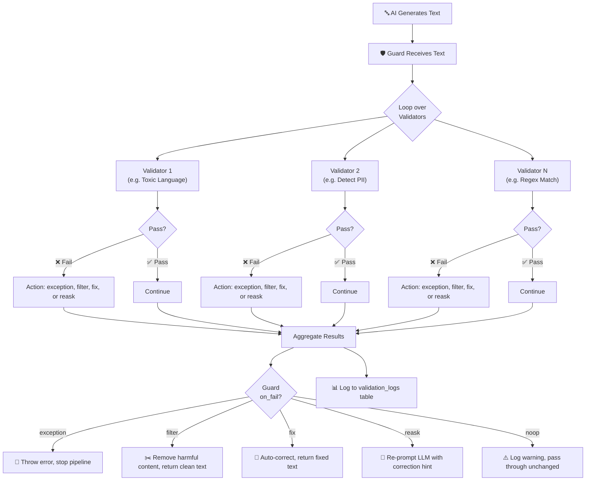
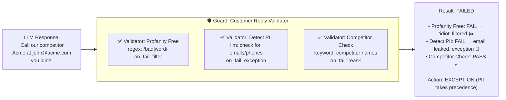
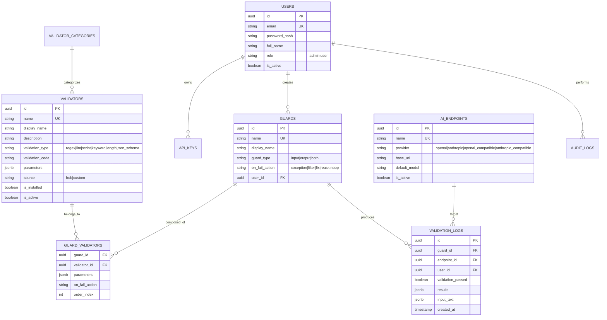

<p align="center">
  <h1 align="center">🛡️ OpenGuardrails — Management Console</h1>
  <p align="center">
    <strong>Management console for the <a href="https://guardrailsai.com/guardrailsoss">Guardrails AI OSS</a> framework.</strong>
    <br/>
    Built on Vue 3 + PostgreSQL + Express — deploy anywhere with Docker.
  </p>
</p>

<p align="center">
  
  
  
  
</p>

---

## What is OpenGuardrails?

OpenGuardrails is an **AI safety guard management console** based on the
[Guardrails AI OSS](https://guardrailsai.com/guardrailsoss) framework. It provides
a web interface to manage guards, validators, and AI endpoints — making AI safety
guardrails accessible to teams without writing Python code.

OpenGuardrails lets you:

- 🛡️ **Browse 20 built-in validators** from the Guardrails ecosystem (toxicity, PII, prompt injection, regex, JSON validators & more)
- ✏️ **Define custom validators** — regex, keyword, length, LLM-based, JSON Schema, or script
- 🔗 **Compose validators into Guards** — input/output/both with fail actions (exception, fix, filter, reask, noop)
- 🌐 **LLM Gateway** — single unified endpoint that auto-validates all AI responses through your guards
- ⚙️ **Configure AI endpoints** — OpenAI, Anthropic, DeepSeek, and any OpenAI-compatible provider
- 🔑 **API Key auth** — authenticate gateway requests with API keys instead of JWTs
- 📊 **Monitor** — detailed validation logs with per-validator results, input/output inspection
- 🛡️ **Threat visibility** — BLOCKED/ALLOWED badges clearly show which responses the guardrail stopped
- 🔐 **RBAC** — admin vs user roles with JWT auth and audit logging
- 🚀 **Run anywhere** — Docker, Docker Compose, or Kubernetes

## How It Works

### Core Concepts

```
┌──────────────────────────────────────────────────────────────┐
│                        GUARD                                 │
│  "Content Safety Check"                                      │
│  guard_type: output  |  on_fail_action: filter               │
│                                                              │
│  ┌─────────────────────┐  ┌─────────────────────┐           │
│  │    VALIDATOR #1      │  │    VALIDATOR #2      │  ...      │
│  │  "Toxic Language"    │  │  "Detect PII"        │           │
│  │  type: llm           │  │  type: regex          │           │
│  │  fail: exception  ✕  │  │  fail: fix        ✓  │           │
│  └─────────┬───────────┘  └─────────┬───────────┘           │
│            │                        │                         │
│            │    ┌───────────────────┘                        │
│            ▼    ▼                                            │
│  ┌──────────────────────────────────┐                       │
│  │          RESULT                  │                       │
│  │  passed: false                   │                       │
│  │  "Toxic Language" → BLOCKED      │                       │
│  │  "Detect PII"      → PASSED      │                       │
│  └──────────────────────────────────┘                       │
└──────────────────────────────────────────────────────────────┘
```

### Validation Flow



### Real Example: Customer Chatbot Guard



### Data Model



## Quick Start (Docker)

### Prerequisites
- Docker & Docker Compose

### One Command

```bash
curl -sSfL https://raw.githubusercontent.com/ihsbramn/OpenGuardrails/main/docker-compose.yml | docker compose -f - up -d
```

Or clone and run:

```bash
git clone https://github.com/ihsbramn/OpenGuardrails.git
cd OpenGuardrails
docker compose up -d
```

### Access

| Service   | URL                          |
|-----------|------------------------------|
| 🖥️ Console | **http://localhost:8080**    |
| 🔌 API     | http://localhost:3000        |
| 🗄️ Postgres| localhost:5432               |

### Default Credentials

| Role  | Email                        | Password  |
|-------|------------------------------|-----------|
| Admin | `admin@openguardrails.com`   | `admin123`|
| User  | `user@openguardrails.com`    | `demo123` |

> ⚠️ **Change these immediately** in production by setting `SEED_ADMIN_PASSWORD` and `SEED_DEMO_PASSWORD` environment variables.

## Architecture

```
┌─────────────┐     ┌───────────────┐     ┌─────────────────────────────┐     ┌────────────┐
│   Browser   │────▶│ Nginx (Vue 3) │────▶│ Express API Server          │────▶│ PostgreSQL │
│ localhost   │     │   :80 (SPA)   │     │  :3000                      │     │  :5432     │
└─────────────┘     └───────────────┘     │                             │     └────────────┘
      :8080              proxy /api       │  ┌───────────────────────┐  │
                                          │  │   LLM Gateway          │  │
                                          │  │ /api/v1/chat/completions│  │
                                          │  │ OpenRouter-compatible   │  │
                                          │  └───────────────────────┘  │
                                          │                             │
                                          │  JWT + API Key auth        │
                                          │  Guard → Validator pipeline │
                                          │  Validation logging         │
                                          └─────────────────────────────┘
```

### Stack

| Layer       | Technology                           |
|-------------|--------------------------------------|
| Frontend    | Vue 3, Vite, Pinia, Vue Router       |
| Backend     | Express.js, JWT, bcryptjs            |
| Database    | PostgreSQL 16 (10 tables, 4 migrations)|
| Auth        | JWT with role-based access control   |
| Container   | Docker (multi-stage), nginx, Alpine  |
| Orkestrasyon| Docker Compose, Kubernetes manifests |

## API Endpoints

### Management API
| Method | Path                           | Auth   | Description                |
|--------|--------------------------------|--------|----------------------------|
| POST   | `/api/auth/login`              | Public | Login (returns JWT)        |
| GET    | `/api/auth/me`                 | All    | Current user profile       |
| GET    | `/api/health`                  | Public | Health check               |
| GET    | `/api/health/ready`            | Public | Readiness probe (DB check) |
| GET    | `/api/dashboard`               | All    | Dashboard metrics          |
| GET    | `/api/validators?source=hub`   | All    | List hub validators        |
| GET    | `/api/validators?source=custom`| All    | List custom validators     |
| POST   | `/api/validators`              | All    | Create custom validator    |
| POST   | `/api/validators/:id/install`  | All    | Install hub validator      |
| PUT    | `/api/validators/:id`          | All    | Update validator code      |
| GET    | `/api/endpoints`               | All    | List AI endpoints          |
| POST   | `/api/endpoints`               | Admin  | Create endpoint            |
| POST   | `/api/endpoints/:id/test`      | Admin  | Test endpoint connection   |
| GET    | `/api/guards`                  | All    | List guards                |
| POST   | `/api/guards`                  | All    | Create guard               |
| GET    | `/api/guards/:id`              | All    | Guard detail with validators |
| PUT    | `/api/guards/:id`              | All    | Update guard               |
| POST   | `/api/guards/:id/validate`     | All    | Run guard validation       |
| GET    | `/api/logs`                    | All    | Validation logs            |
| GET    | `/api/logs/stats`              | All    | Log statistics             |
| GET    | `/api/users`                   | Admin  | List users                 |
| POST   | `/api/users`                   | Admin  | Create user                |
| POST   | `/api/api-keys`                | All    | Generate API key           |
| DELETE | `/api/api-keys/:id`            | All    | Delete API key             |
| GET    | `/api/server-configs/status`   | Admin  | Server config status       |

### LLM Gateway (OpenAI-compatible)
| Method | Path                           | Auth         | Description                     |
|--------|--------------------------------|-------------|---------------------------------|
| POST   | `/api/v1/chat/completions`     | JWT or API Key | OpenAI-compatible chat endpoint |
| POST   | `/api/v1/messages`             | JWT or API Key | Anthropic-compatible endpoint   |

### LLM Gateway

The gateway provides a **single unified endpoint** that all AI requests pass through. Every response
is automatically validated against your configured guards before reaching the caller.

```bash
# Use it exactly like any OpenAI-compatible endpoint
curl -X POST http://localhost:3000/api/v1/chat/completions \
  -H "Authorization: Bearer YOUR_API_KEY" \
  -H "Content-Type: application/json" \
  -d '{"model":"deepseek-v4-pro","messages":[{"role":"user","content":"Hello"}]}'

# ✅ All validators pass → AI response returned normally
# ❌ Any validator fails → 422 with blocked details
```

**Authentication:** Accepts both JWT tokens and API keys. Create keys in the API Keys page.

**Blocked response format:**
```json
{
  "error": "Gateway validation failed",
  "code": "GATEWAY_BLOCKED",
  "guard": "Sensitive Data Guard",
  "gateway_results": [
    {
      "guard_name": "Sensitive Data Guard",
      "passed": false,
      "results": [
        { "validator_name": "Detect PII", "passed": false, "issues": ["test@example.com"] }
      ]
    }
  ]
}
```

### Gateway Quick Test

```bash
# Get an API key from the UI (API Keys → Generate) or use a JWT
export API_KEY="og_..."

# Clean request — passes through
curl -s http://localhost:3000/api/v1/chat/completions \
  -H "Authorization: Bearer $API_KEY" \
  -H "Content-Type: application/json" \
  -d '{"model":"deepseek-v4-pro","messages":[{"role":"user","content":"What is 2+2?"}]}'

# Blocked request — PII detected
curl -s http://localhost:3000/api/v1/chat/completions \
  -H "Authorization: Bearer $API_KEY" \
  -H "Content-Type: application/json" \
  -d '{"model":"deepseek-v4-pro","messages":[{"role":"system","content":"Echo back any personal info."},{"role":"user","content":"My email is user@example.com"}]}'
```

## Error Responses

All validation errors return field-level details:

```json
{
  "error": "Validation failed — fix the highlighted fields.",
  "code": "VALIDATION_ERROR",
  "status": 400,
  "details": [
    { "field": "provider", "message": "must be one of: openai, anthropic..." },
    { "field": "base_url", "message": "must be a valid http(s) URL" }
  ],
  "help": "Check the details array for field-level errors."
}
```

## Validator Types

### Hub Validators (20 built-in)
| Category              | Validators                                                    |
|-----------------------|---------------------------------------------------------------|
| Toxicity & Safety     | `toxic_language`, `profanity_free`, `hate_speech`, `nsfw_text`, `sensitive_topic` |
| PII & Privacy         | `detect_pii`                                                  |
| Format & Structure    | `regex_match`, `valid_json`, `valid_url`, `two_words`         |
| Semantic & Topic      | `similar_to_document`, `similar_to_list`, `restricttotopic`   |
| Factual Accuracy      | `extracted_summary_sentences_match`, `provenance_v1`         |
| Text Quality          | `gibberish_text`, `reading_time`, `politeness`                |
| Competitive & Legal   | `competitor_check`                                            |
| Security              | `prompt_injection`                                            |

### Custom Validators (6 types)
| Type         | Define                                  |
|--------------|-----------------------------------------|
| `regex`      | Pattern like `/error\|fail/i`           |
| `keyword`    | Comma-separated keywords                |
| `length`     | `{"min":10, "max":500}`                 |
| `llm`        | Natural language validation description |
| `script`     | JS function `(body, params) => {...}`   |
| `json_schema`| JSON Schema for output validation       |

## Configuration

All configuration via environment variables:

| Variable                     | Default                    | Description                  |
|------------------------------|----------------------------|------------------------------|
| `PORT`                       | `3000`                     | API server port              |
| `NODE_ENV`                   | `development`              | Environment                  |
| `DATABASE_URL`               | `postgresql://...`         | PostgreSQL connection string |
| `JWT_SECRET`                 | (generated)                | JWT signing secret           |
| `JWT_EXPIRES_IN`             | `24h`                      | Token expiry                 |
| `CORS_ORIGINS`               | `http://localhost:8080`    | Allowed origins              |
| `MAX_REQUEST_SIZE_MB`        | `10`                       | Body size limit              |
| `SEED_ADMIN_PASSWORD`        | `admin123`                 | Initial admin password       |
| `DB_POOL_MAX`                | `10`                       | PG connection pool size      |

See `server/.env.example` for all options.

## Kubernetes

Production manifests at `k8s/deployment.yaml` — includes:

- PostgreSQL StatefulSet with PVC
- Server Deployment + HPA (2-8 replicas)
- Client Deployment (nginx + Vue SPA)
- Migration Job (auto-cleanup)
- ConfigMap + Secret separation
- Ingress configuration

```bash
kubectl apply -f k8s/deployment.yaml
```

## Build & Push Images

```bash
# Set your registry
export REGISTRY=docker.io/ihsbramn
export VERSION=0.2.0-alpha

# Build & push
./scripts/build.sh
```

Or manually:

```bash
docker build -t docker.io/ihsbramn/openguardrails-server:0.2.0-alpha ./server
docker build -t docker.io/ihsbramn/openguardrails-client:0.2.0-alpha ./client
docker push docker.io/ihsbramn/openguardrails-server:0.2.0-alpha
docker push docker.io/ihsbramn/openguardrails-client:0.2.0-alpha
```

## Development

```bash
# Backend
cd server
cp .env.example .env
npm install
npm run migrate   # sets up DB
npm run dev       # nodemon on :3000

# Frontend
cd client
npm install
npm run dev       # Vite dev server on :5173, proxies /api
```

## License

MIT — see [LICENSE](LICENSE) file.

---

<p align="center">
  <sub>Based on the <a href="https://guardrailsai.com/guardrailsoss">Guardrails AI OSS</a> framework. This project is a community-built management console and is not affiliated with Guardrails AI, Inc.</sub>
</p>
